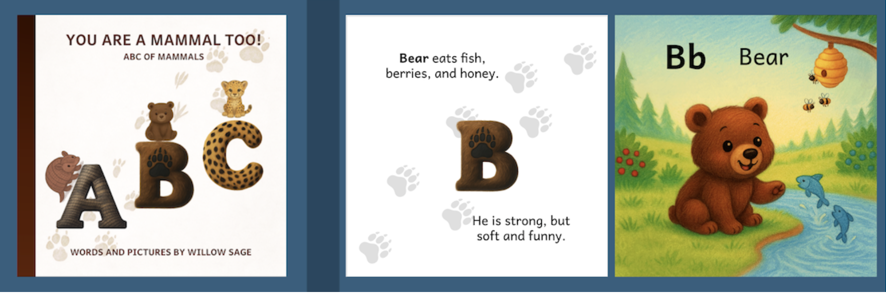

```{r setup, include = F}
knitr::opts_chunk$set(echo = F)
```


```{r, fig.cap="", out.width = '100%', fig.align='center'}
    knitr::include_graphics("images/banner.png")
```


---


[**BOOK 1: YOU ARE A MAMMAL TOO!**](https://www.amazon.com/You-Are-Mammal-Too-Adventures/dp/B0FWRNMNC2/ref=tmm_pap_swatch_0)

```{r, fig.cap="", out.width = '100%', fig.align='center'}
    
```


---


[**BOOK 2: MY FIRST BIRD BOOK**](https://www.amazon.com/Z-Feathered-Friends-Adventures-Willow/dp/B0G4J36P28/ref=tmm_pap_swatch_0?_encoding=UTF8&dib_tag=se&dib=eyJ2IjoiMSJ9.qM2TBmx38qnOduWvI4h4Qg4NNvmYK7m-sJuMrGEgl2Q.qzVwnaZiA4sztb-mArxIxtKZOrxqfCOMKRerwzwUE78&qid=1769740771&sr=1-1) 


```{r, fig.cap="", out.width = '100%', fig.align='center'}
    knitr::include_graphics("images/birds.png")
```


---


[**📚 BOOK 3: BELLA AND GARY'S QUEST FOR THE NEST**](https://www.amazon.com/BELLA-GARYS-QUEST-NEST-WILLOW/dp/B0G5DB3CD6/ref=tmm_pap_swatch_0) 


```{r, fig.cap="", out.width = '100%', fig.align='center'}
    knitr::include_graphics("images/hornbills.png")
```


---


**Email: <contact.willowsage@gmail.com>**

**Copyright © 2026 Willow Sage LLC**

---


